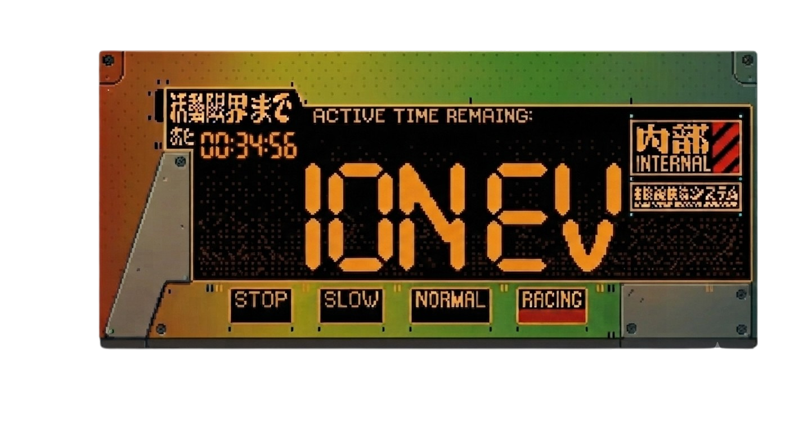
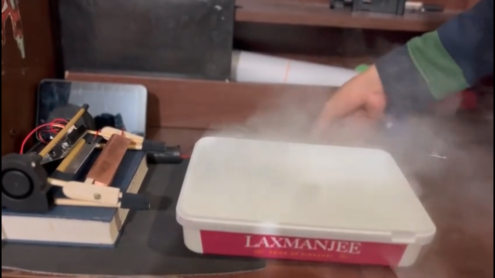
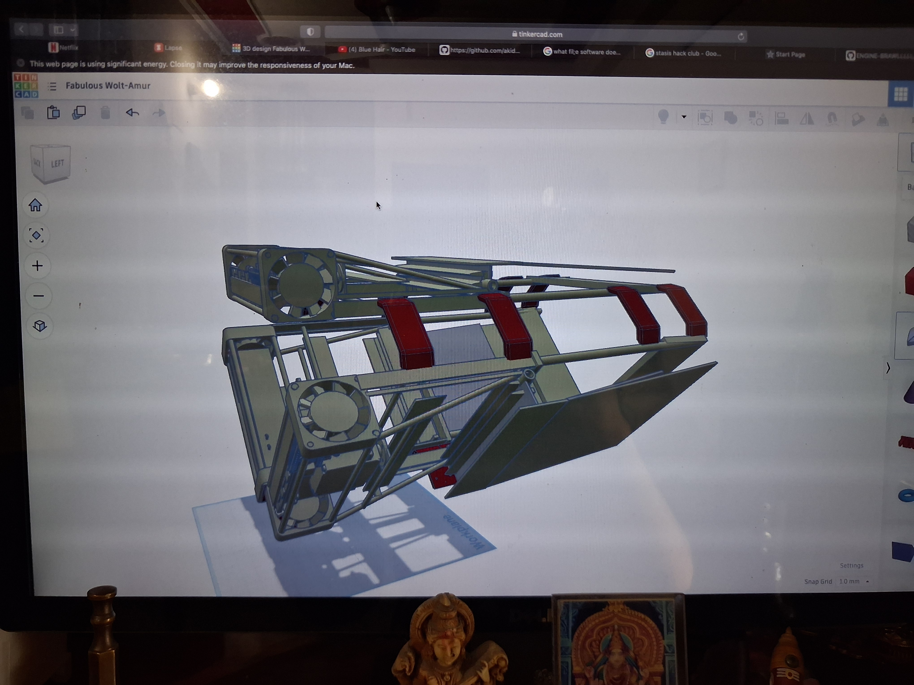

  

  
  
  

  <b>A DIY electrohydrodynamic propulsion experiment.</b>
   
  Exploring ion propulsion, airflow design, and unconventional engine architecture.

  <a href="https://youtu.be/s0be5zCcTM0">Project Video</a>
  &nbsp;&nbsp;•&nbsp;&nbsp;
  <a href="https://canva.link/vbg03uz2dkxmrlg">Project Presentation</a>
  &nbsp;&nbsp;•&nbsp;&nbsp;
  <a href="https://www.dropbox.com/scl/fo/5a8y4ja5gzko9gjgup22n/AL07_JO_Z620Ef6J4IukiO8?rlkey=nrhe427lqlk3c0s6twcmdkp5x&st=qsvfkxlt&dl=0">STEP Files</a>

---

## About

**ION EV** is an experimental ion propulsion system designed and built from scratch to investigate electrohydrodynamic propulsion and unconventional engine architecture.

Unlike conventional mechanical propulsion systems, the engine uses an electric field to ionize and accelerate air, generating **ionic wind and measurable thrust without conventional rotating components**.

The design combines a custom ionization system with a **funnel-shaped airflow architecture**, developed specifically to investigate how geometry can influence the resulting airflow and propulsion performance.

The project is primarily an engineering experiment: build, measure, redesign, and repeat.

> No propeller. No turbine. Just electricity, air, and a ridiculous amount of engineering.

---

## How It Works

ION EV operates using the principles of **electrohydrodynamic propulsion**.

An electric field ionizes molecules in the surrounding air. These charged particles are then accelerated through the electric field, transferring momentum to neutral air molecules as they move.

This creates a directed flow of air known as **ionic wind**, which can produce measurable thrust.

The project focuses heavily on the geometry surrounding this process, particularly the custom funnel system intended to guide and concentrate the generated airflow.

---

## Project Gallery

  

  <i>The completed ION EV experimental propulsion system.</i>

### Construction

  

  <i>Construction and assembly of the propulsion system.</i>

### Testing

  

  <i>Experimental testing and airflow measurement.</i>

### CAD Development

  

  <i>CAD development of the engine and custom funnel system.</i>

---

## Project Video

  

  <b><a href="https://youtu.be/s0be5zCcTM0">Watch the ION EV project video</a></b>

---

## Project Documentation

A detailed visual presentation covering the project's design, development, and experimentation is available here.

  

---

## What Is Included

- Custom propulsion system design
- Custom funnel airflow system
- 3D CAD models
- High-voltage ionization system
- Airflow measurement setup
- Thrust experimentation
- Electronics and control system
- STL and OBJ model files
- Project documentation
- Experimental results and observations

---

## CAD Files

The STEP files are too large to store directly in this repository.

  

STL and OBJ versions of the models are included in the repository where possible.

---

## Bill of Materials

| Component | Quantity | Approx. Price | Distributor |
|---|---:|---:|---|
| Arduino Due / Mega | 1 | $43 | Amazon |
| Centrifugal Air Ducts | 4 | $3 | Amazon |
| Anemometer | 1 | $13 | Amazon |
| Heavy-Duty Wire Connectors | 3 | $6 | Amazon |
| FLYSKY F16X Transmitter | 1 | $24 | Amazon |
| Servo Tester | 1 | $2 | Amazon |
| Servo | 3 | $4 | Amazon |
| Foam Board | 2 | $11 | Vortex RC / Flight Test Store |

> This is a basic reference BOM. Components, prices, and suppliers may differ depending on availability and the exact version being built.

---

## Project Goals

The main objective of ION EV is to investigate the engineering possibilities and limitations of electrohydrodynamic propulsion.

### Questions Being Explored

- How much measurable thrust can be generated?
- How does funnel geometry affect airflow?
- How efficiently can the generated ionic wind be directed?
- Can the system be made lighter and more efficient?
- What are the practical limitations of this type of propulsion?
- Which design changes produce measurable improvements?

This project is an **experimental propulsion platform**, not a finished aircraft engine.

---

## Design Inspiration

ION EV draws inspiration from both real aerospace engineering and science-fiction spacecraft.

The aerodynamic architecture takes inspiration from unconventional engine designs such as **aerospike engines**, while the external form was heavily influenced by the spacecraft designs of *Star Trek*.

In particular, the engine's nacelle-like geometry was inspired by the **USS Discovery** and **USS Enterprise**.

The faint glow produced around the ionizing edge was also one of the reasons I became fascinated with ion propulsion in the first place.

If an engine is going to look futuristic, it might as well actually be futuristic.

---

## Safety

This project involves **high-voltage electrical systems**.

High voltage can cause serious injury or death. The experimental nature of this project means that appropriate electrical safety precautions, insulation, isolation, and controlled testing are essential.

This repository documents the engineering and development of the project and should not be treated as a guarantee that the design is safe to reproduce without appropriate knowledge and precautions.

---

## Contact

  <b>Instagram</b>
   
  <a href="https://instagram.com/not.akido">@not.akido</a>

---

  <i>Built to experiment. Built to fail. Built to learn.</i>

